# Python - CLI Print Tool
Improve the readability and appearance of your print statements.

---

## How to get started
1. Import the `CLIPrintTool` class from `cli_print_tool.py`
```python
from cli_print_tool import CLIPrintTool
```
(Optional) Import the `TextAlignment` class from `cli_print_tool.py` to change the text alignment (by default left-aligned).
```python
from cli_print_tool import CLIPrintTool, TextAlignment
```

2. Create a `CLIPrintTool` object.
```python
CLIPrintTool()
```
(Optional) Specify the maximum line length for your content (by default 100 characters).
```python
CLIPrintTool(120)  # custom max length of 120 characters
```

3. Use the [public methods](#list-of-public-methods) from `CLIPrintTool` to print your formatted text content.
```python
CLIPrintTool().textbox("Hello World!")
```

---

## List of public methods
1. [Textbox](#textbox)
2. [Heading](#heading)
3. [List](#list)

---

## Textbox
Takes two parameters and prints text inside a box.

### Parameters
<table>
    <thead>
        <tr>
            <th>Parameter</th>
            <th>Type</th>
            <th>Required</th>
            <th>Default Value</th>
        </tr>
    </thead>
    <tbody>
        <tr>
            <td>text</td>
            <td>String</td>
            <td>Yes</td>
            <td>None</td>
        </tr>
        <tr>
            <td>alignment</td>
            <td>TextAlignment</td>
            <td>No</td>
            <td>TextAlignment.left</td>
        </tr>
    </tbody>
</table>

### Examples
#### Example 1
Prints text inside a box and left-aligned.
```python
CLIPrintTool().textbox("The quick, brown fox jumps over a lazy dog.")
```
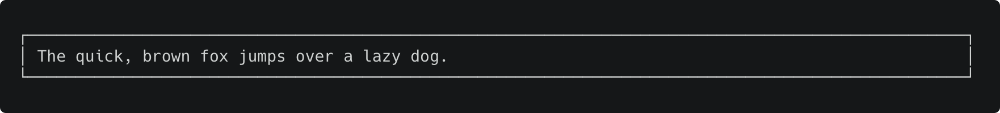
#### Example 2
Prints text inside a box and centered.
```python
CLIPrintTool().textbox("The quick, brown fox jumps over a lazy dog.", TextAlignment.center)
```
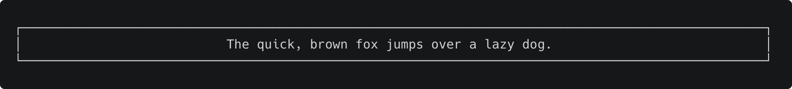
#### Example 3
Prints text inside a box and right-aligned.
```python
CLIPrintTool().textbox("The quick, brown fox jumps over a lazy dog.", TextAlignment.right)
```
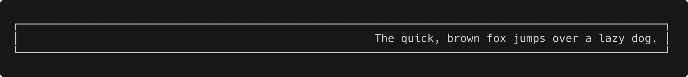

---

## Heading
Takes three parameters and prints two texts vertically separated by a line (divider).

### Parameters
<table>
    <thead>
        <tr>
            <th>Parameter</th>
            <th>Type</th>
            <th>Required</th>
            <th>Default Value</th>
        </tr>
    </thead>
    <tbody>
        <tr>
            <td>title</td>
            <td>String</td>
            <td>Yes</td>
            <td>None</td>
        </tr>
        <tr>
            <td>subtitle</td>
            <td>String</td>
            <td>Yes</td>
            <td>None</td>
        </tr>
        <tr>
            <td>alignment</td>
            <td>TextAlignment</td>
            <td>No</td>
            <td>TextAlignment.left</td>
        </tr>
    </tbody>
</table>

### Examples
#### Example 1
Prints two texts vertically separated by a line (divider) and left-aligned.
```python
CLIPrintTool().heading("This is a Title", "This is a Subtitle")
```
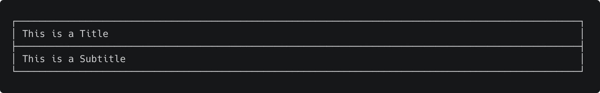
#### Example 2
Prints two texts vertically separated by a line (divider) and centered.
```python
CLIPrintTool().heading("This is a Title", "This is a Subtitle", TextAlignment.center)
```

#### Example 3
Prints two texts vertically separated by a line (divider) and right-aligned.
```python
CLIPrintTool().heading("This is a Title", "This is a Subtitle", TextAlignment.right)
```
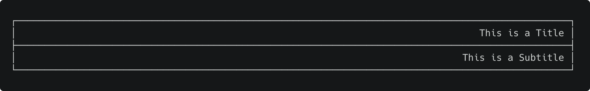

---

## List
Takes three parameters and prints a list of elements vertically with a title (optional).

### Parameters
<table>
    <thead>
        <tr>
            <th>Parameter</th>
            <th>Type</th>
            <th>Required</th>
            <th>Default Value</th>
        </tr>
    </thead>
    <tbody>
        <tr>
            <td>elements</td>
            <td>List of String</td>
            <td>Yes</td>
            <td>None</td>
        </tr>
        <tr>
            <td>title</td>
            <td>String</td>
            <td>No</td>
            <td>""</td>
        </tr>
        <tr>
            <td>alignment</td>
            <td>TextAlignment</td>
            <td>No</td>
            <td>TextAlignment.left</td>
        </tr>
    </tbody>
</table>

### Examples
#### Example 1
Prints a list of elements vertically without title and left-aligned.
```python
CLIPrintTool().list(["System Information", "Crash Reports", "Exit"])
```
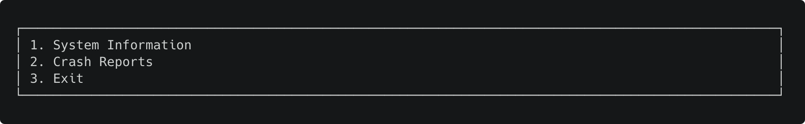
#### Example 2
Prints a list of elements vertically without title and centered.
```python
CLIPrintTool().list(["System Information", "Crash Reports", "Exit"], "", TextAlignment.center)
```
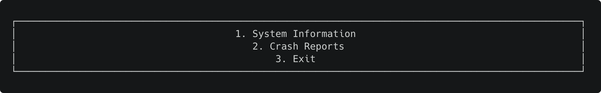
#### Example 3
Prints a list of elements vertically without title and right-aligned.
```python
CLIPrintTool().list(["System Information", "Crash Reports", "Exit"], "", TextAlignment.right)
```
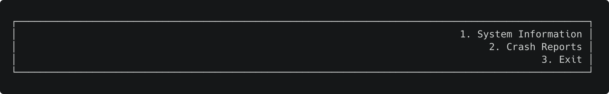
#### Example 4
Prints a list of elements vertically with title and left-aligned.
```python
CLIPrintTool().list(["System Information", "Crash Reports", "Exit"], "MAIN MENU")
```
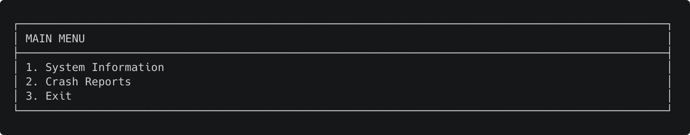
#### Example 5
Prints a list of elements vertically with title and centered.
```python
CLIPrintTool().list(["System Information", "Crash Reports", "Exit"], "MAIN MENU", TextAlignment.center)
```
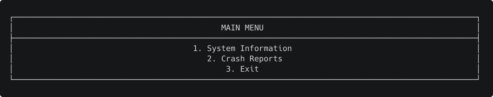
#### Example 6
Prints a list of elements vertically with title and right-aligned.
```python
CLIPrintTool().heading("This is a Title", "This is a Subtitle", TextAlignment.right)
```
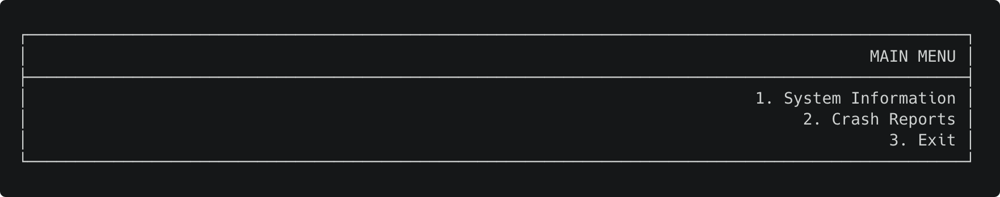