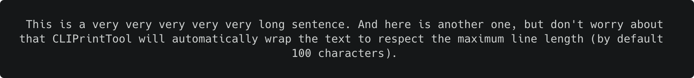

# Python - CLI Print Tool
Improve the readability and appearance of your print statements.

---

## How to get started
If you would rather take a look at the code instead of the documentation, open directly the `example.py` file.

### Step 1 - Import the class
Import the `CLIPrintTool` class from `cli_print_tool.py`
```python
from cli_print_tool import CLIPrintTool
```
(Optional) Import the `TextAlignment` class from `cli_print_tool.py` to change the text alignment (by default left-aligned).
```python
from cli_print_tool import CLIPrintTool, TextAlignment
```

### Step 2 - Create a class object
Create a `CLIPrintTool` object.
```python
CLIPrintTool()
```
(Optional) Specify the maximum line length for your content (by default 100 characters).
```python
CLIPrintTool(120)  # custom max length of 120 characters
```

### Step 3 - Use the public object methods
Use the [public methods](#list-of-public-methods) from `CLIPrintTool` to print your formatted text content.
```python
CLIPrintTool().textbox("Hello World!")
```

---

## List of public methods
1. [Text](#text)
2. [Textbox](#textbox)
3. [Heading](#heading)
4. [List](#list)

---

## Text
Takes two parameters and prints long text wrapped to respect the maximum line length.

### Parameters
<table>
    <thead>
        <tr>
            <th>Parameter</th>
            <th>Type</th>
            <th>Required</th>
            <th>Default Value</th>
        </tr>
    </thead>
    <tbody>
        <tr>
            <td>text</td>
            <td>String</td>
            <td>Yes</td>
            <td>None</td>
        </tr>
        <tr>
            <td>alignment</td>
            <td>TextAlignment</td>
            <td>No</td>
            <td>TextAlignment.left</td>
        </tr>
    </tbody>
</table>

### Examples
#### Example 1
Prints long text wrapped to respect the maximum line length and left-aligned.
```python
long_text = "This is a very very very very very long sentence. And here is another one, but don't worry about that \
CLIPrintTool will automatically wrap the text to respect the maximum line length (by default 100 characters)."

CLIPrintTool().text(long_text)
```


#### Example 2
Prints long text wrapped to respect the maximum line length and centered.

**Note:** The `TextAlignment` class needs to be imported from `cli_print_tool.py` to change the text alignment.
```python
long_text = "This is a very very very very very long sentence. And here is another one, but don't worry about that \
CLIPrintTool will automatically wrap the text to respect the maximum line length (by default 100 characters)."

CLIPrintTool().text(long_text, TextAlignment.center)
```


#### Example 3
Prints long text wrapped to respect the maximum line length and right-aligned.

**Note:** The `TextAlignment` class needs to be imported from `cli_print_tool.py` to change the text alignment.
```python
long_text = "This is a very very very very very long sentence. And here is another one, but don't worry about that \
CLIPrintTool will automatically wrap the text to respect the maximum line length (by default 100 characters)."

CLIPrintTool().text(long_text, TextAlignment.right)
```


---

## Textbox
Takes two parameters and prints text inside a box.

### Parameters
<table>
    <thead>
        <tr>
            <th>Parameter</th>
            <th>Type</th>
            <th>Required</th>
            <th>Default Value</th>
        </tr>
    </thead>
    <tbody>
        <tr>
            <td>text</td>
            <td>String</td>
            <td>Yes</td>
            <td>None</td>
        </tr>
        <tr>
            <td>alignment</td>
            <td>TextAlignment</td>
            <td>No</td>
            <td>TextAlignment.left</td>
        </tr>
    </tbody>
</table>

### Examples
#### Example 1
Prints text inside a box and left-aligned.
```python
CLIPrintTool().textbox("The quick, brown fox jumps over a lazy dog.")
```


#### Example 2
Prints text inside a box and centered.

**Note:** The `TextAlignment` class needs to be imported from `cli_print_tool.py` to change the text alignment.
```python
CLIPrintTool().textbox("The quick, brown fox jumps over a lazy dog.", TextAlignment.center)
```


#### Example 3
Prints text inside a box and right-aligned.

**Note:** The `TextAlignment` class needs to be imported from `cli_print_tool.py` to change the text alignment.
```python
CLIPrintTool().textbox("The quick, brown fox jumps over a lazy dog.", TextAlignment.right)
```


---

## Heading
Takes four parameters and prints two texts vertically separated by a line (divider).

Alignment of title and subtitle could be optionally altered using the `TextAlignment` enum.


### Parameters
<table>
    <thead>
        <tr>
            <th>Parameter</th>
            <th>Type</th>
            <th>Required</th>
            <th>Default Value</th>
        </tr>
    </thead>
    <tbody>
        <tr>
            <td>title</td>
            <td>String</td>
            <td>Yes</td>
            <td>None</td>
        </tr>
        <tr>
            <td>subtitle</td>
            <td>String</td>
            <td>Yes</td>
            <td>None</td>
        </tr>
        <tr>
            <td>title_alignment</td>
            <td>TextAlignment</td>
            <td>No</td>
            <td>TextAlignment.left</td>
        </tr>
        <tr>
            <td>subtitle_alignment</td>
            <td>TextAlignment</td>
            <td>No</td>
            <td>TextAlignment.left</td>
        </tr>
    </tbody>
</table>

### Examples
#### Example 1
Prints two texts vertically separated by a line (divider) and left-aligned.
```python
CLIPrintTool().heading("This is a Title", "This is a Subtitle")
```


#### Example 2
Prints two texts vertically separated by a line (divider) and centered.

**Note:** The `TextAlignment` class needs to be imported from `cli_print_tool.py` to change the text alignment.
```python
CLIPrintTool().heading("This is a Title", "This is a Subtitle", TextAlignment.center)
```


#### Example 3
Prints two texts vertically separated by a line (divider) and right-aligned.

**Note:** The `TextAlignment` class needs to be imported from `cli_print_tool.py` to change the text alignment.
```python
CLIPrintTool().heading("This is a Title", "This is a Subtitle", TextAlignment.right)
```


#### Example 4
Prints two texts separated by a line (divider), with title vertically centred, and subtitle left-aligned.

**Note:** The `TextAlignment` class needs to be imported from `cli_print_tool.py` to change the text alignment.
```python
CLIPrintTool().heading("This is a Title", "This is a Subtitle", title_alignment=TextAlignment.center, subtitle_alignment=TextAlignment.left)
```


---

## List
Takes four parameters and prints a list of elements vertically with a title (optional).

Alignment of elements and title could be optionally altered using the `TextAlignment` enum.

**Note:** Blank lines can be added between elements by using the `CLIPrintTool.NEW_LINE` constant. To see how it's used, refer to [example 4.1](#example-41).

### Parameters
<table>
    <thead>
        <tr>
            <th>Parameter</th>
            <th>Type</th>
            <th>Required</th>
            <th>Default Value</th>
        </tr>
    </thead>
    <tbody>
        <tr>
            <td>elements</td>
            <td>List of String</td>
            <td>Yes</td>
            <td>None</td>
        </tr>
        <tr>
            <td>title</td>
            <td>String</td>
            <td>No</td>
            <td>""</td>
        </tr>
        <tr>
            <td>title_alignment</td>
            <td>TextAlignment</td>
            <td>No</td>
            <td>TextAlignment.left</td>
        </tr>
        <tr>
            <td>elements_alignment</td>
            <td>TextAlignment</td>
            <td>No</td>
            <td>TextAlignment.left</td>
        </tr>
    </tbody>
</table>

### Examples
#### Example 1
Prints a list of elements vertically without title and left-aligned.
```python
CLIPrintTool().list(["System Information", "Crash Reports", "Exit"])
```


#### Example 2
Prints a list of elements vertically without title and centered.

**Note:** The `TextAlignment` class needs to be imported from `cli_print_tool.py` to change the text alignment.
```python
CLIPrintTool().list(["System Information", "Crash Reports", "Exit"], "", TextAlignment.center)
```


#### Example 3
Prints a list of elements vertically without title and right-aligned.

**Note:** The `TextAlignment` class needs to be imported from `cli_print_tool.py` to change the text alignment.
```python
CLIPrintTool().list(["System Information", "Crash Reports", "Exit"], "", TextAlignment.right)
```


#### Example 4
Prints a list of elements vertically with title and left-aligned.
```python
CLIPrintTool().list(["System Information", "Crash Reports", "Exit"], "MAIN MENU")
```


#### Example 4.1
Prints a list of elements vertically with title and left-aligned.

**Note:** The `CLIPrintTool.NEW_LINE` constant was added inside our list of menu options to display a blank line.
```python
menu_options = ["System Information", "Crash Reports", CLIPrintTool.NEW_LINE, "Exit"]
CLIPrintTool().list(menu_options, "MAIN MENU")
```


#### Example 5
Prints a list of elements vertically with title and centered.

**Note:** The `TextAlignment` class needs to be imported from `cli_print_tool.py` to change the text alignment.
```python
CLIPrintTool().list(["System Information", "Crash Reports", "Exit"], "MAIN MENU", TextAlignment.center)
```


#### Example 6
Prints a list of elements vertically with title and right-aligned.

**Note:** The `TextAlignment` class needs to be imported from `cli_print_tool.py` to change the text alignment.
```python
CLIPrintTool().list(["System Information", "Crash Reports", "Exit"], "MAIN MENU", TextAlignment.right)
```


#### Example 7
Prints a list of elements left-aligned, with title center-aligned.

**Note:** The `TextAlignment` class needs to be imported from `cli_print_tool.py` to change the text alignment.
```python
CLIPrintTool().list(["System Information", "Crash Reports", "Exit"], "MAIN MENU", title_alignment=TextAlignment.center, elements_alignment=TextAlignment.left)
```
